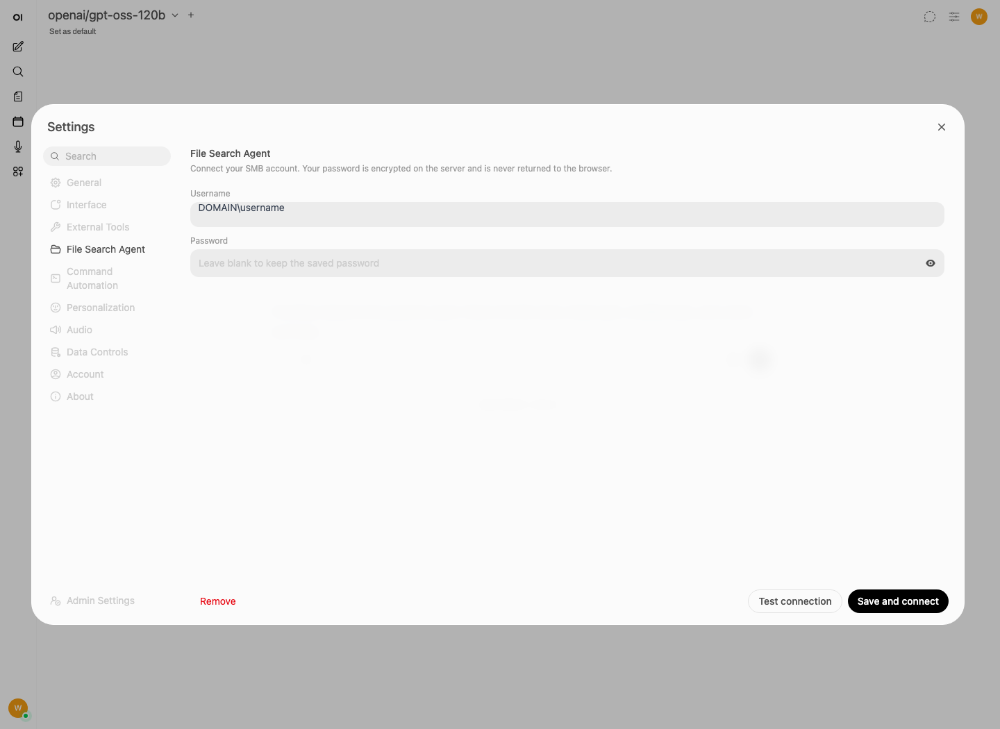
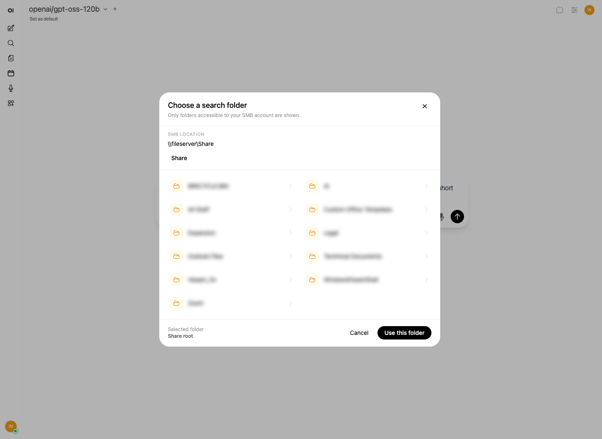
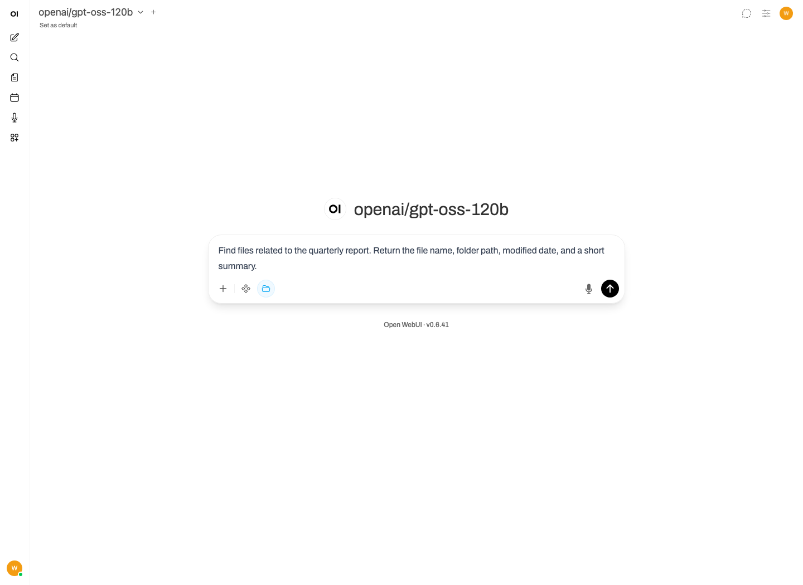

# Using File Search Agent in Open WebUI

This guide explains how to connect an SMB account, choose a search folder, and run a file search in Open WebUI.

## Prerequisites

Before starting, confirm that:

- Open WebUI is running and you can sign in.
- The Open WebUI administrator has configured the SMB server and share for File Search Agent.
- Your SMB account has permission to read the folders and files you want to search.
- A chat model is available in Open WebUI.

## 1. Configure the SMB account

1. Open Open WebUI.
2. Click your user avatar to open the user menu.
3. Select **Settings**.
4. Select **File Search Agent** in the left navigation.
5. Enter the SMB account information:
   - **Username**: Use the format required by the SMB server, such as `DOMAIN\username`
   - **Password**: Enter the SMB account password.
6. Click **Test connection**.
7. After the connection test succeeds, click **Save and connect**.



The password is encrypted on the Open WebUI server and is not returned to the browser. After a password has been saved, the password field displays **Leave blank to keep the saved password**. Leave it blank when testing or saving again unless you want to replace the password.

To remove the saved account, return to this page and click **Remove**.

## 2. Choose the folder to search

1. Start a new chat and select a model.
2. Click the integrations button next to the **+** button in the message composer.
3. Select **File Search Agent**.
4. In **Choose a search folder**:
   - Click a folder to open it.
   - Use the breadcrumb path at the top to return to an earlier folder.
   - Click **Up** to move to the parent folder.
   - Click **Use this folder** when the required folder is shown under **Selected folder**.



Select **Share root** to search all accessible supported files under the configured SMB share. Selecting a narrower folder usually makes searches faster and reduces unrelated matches. The folder picker only displays folders that the configured SMB account can open.

After selection, a blue folder icon appears in the message composer. This indicates that File Search Agent is enabled. Click that icon to disable file search.

## 3. Run a test search

Enter a clear request that includes:

- The file topic or likely filename.
- Any distinguishing terms, project names, dates, or document types.
- The fields or summary format you want in the answer.

Example:

```text
Find files related to the quarterly report. Return the file name, folder path,
modified date, and a short summary.
```



Click **Send**. Open WebUI searches within the selected folder, adds the best matching file content to the model context, and shows file-search activity while the request is running.

## Additional test inputs

Search for a known document:

```text
Find the deployment guide for Project Atlas. Summarize the prerequisites and
installation steps, and identify the source file.
```

Search for an exact phrase:

```text
Find documents containing the phrase "change approval board". List the matching
files and quote the surrounding section.
```

Compare multiple documents:

```text
Compare the onboarding procedures in this folder. Summarize the common steps,
differences, and any conflicting requirements. Cite the source file for each
finding.
```

Search by filename and file type:

```text
Find Excel files whose names or contents relate to the 2026 budget. For each
match, return the filename, relative path, and a short description.
```

## Supported file types

The current implementation searches these formats:

- Documents: `.pdf`, `.docx`, `.xlsx`
- Text and data: `.txt`, `.md`, `.log`, `.csv`, `.tsv`, `.json`, `.jsonl`, `.xml`, `.yaml`, `.yml`, `.ini`, `.cfg`, `.conf`
- Source files: `.py`, `.js`, `.ts`, `.java`, `.go`, `.rs`, `.sql`, `.html`, `.htm`

Unsupported, unreadable, or oversized files may be skipped.
